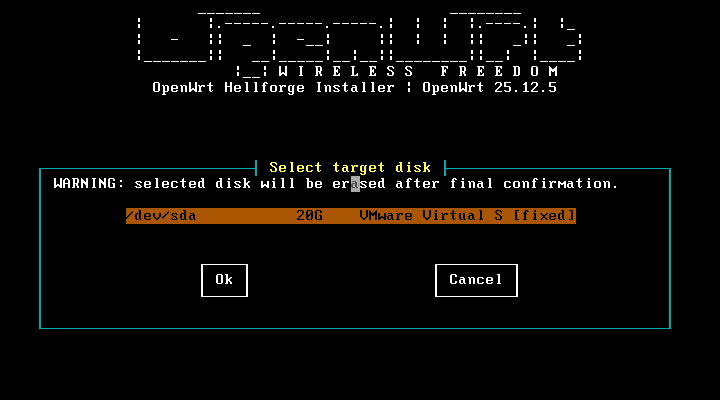
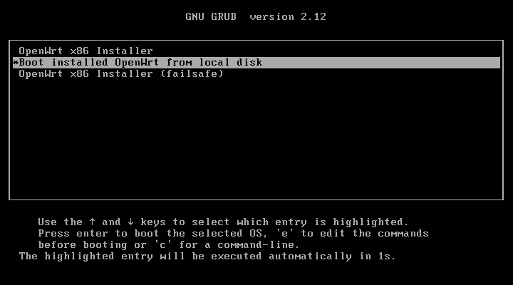
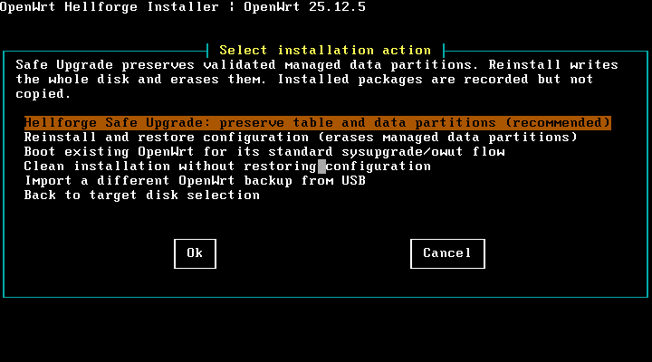
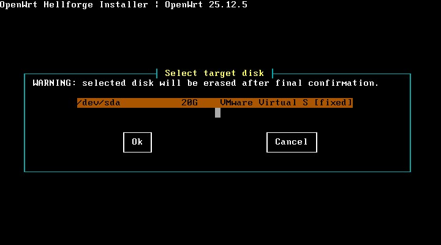
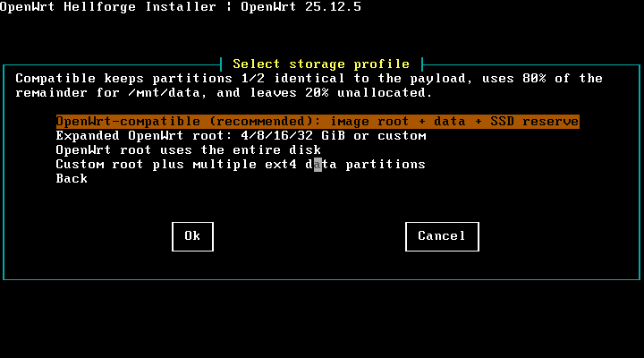

# OpenWrt x86_64 Installer

[](https://github.com/woffko/openwrt-installer/actions/workflows/smoke.yml)

Minimal OpenWrt-based disk installer for x86_64 routers. The project builds an
OpenWrt `25.12.5` live USB image containing a prebuilt target image. The
`owrt-install` wizard writes that payload to an SSD, NVMe, SATA, or virtual
disk and either keeps, bounds, or expands its ext4 root filesystem. An optional boot-menu path can
instead download and verify the latest official stable OpenWrt x86 image in
RAM before running the same installation flow. After target selection, the
interactive installer can also restore a validated OpenWrt configuration
backup from a read-only USB partition, or rescue configuration from an
existing ext4 OpenWrt installation before reinstalling it.
When `/CUSTOM_BUILD` contains compatible user images, the same source picker
can instead stage and validate a local custom OpenWrt build in RAM.

Repository: <https://github.com/woffko/openwrt-installer>

Current prerelease: [v1.0-beta.1](https://github.com/woffko/openwrt-installer/releases/tag/v1.0-beta.1).
This beta has passed the automated QEMU matrix and an interactive VMware boot
and navigation check. It has not yet passed the project schema 4 physical
SATA/NVMe storage and recovery gate, so it is not a bare-metal storage
certification.

This is an MVP. It supports one LAN interface, one WAN interface, DHCP on LAN,
DHCP/DHCPv6 clients on WAN, firewall forwarding from LAN to WAN, NAT, SSH, and
LuCI. Interface selection is saved by MAC address so installed-system device
names do not need to match names used by the live installer.

## Warning

Clean install, USB import, and rescue/reinstall completely erase the selected
disk, including any partitions in the space that will become unallocated.
Hellforge Safe Upgrade is the separate guarded path that preserves a validated
partition table and managed data partitions. Review the target and selected
action carefully.
Do not select the USB device that booted the installer. Removable disks are
blocked unless `--allow-removable` is passed explicitly.

## Host requirements

The build scripts use the official OpenWrt `25.12.5` x86/64 ImageBuilder.
Install these host commands:

```text
curl gzip make sha256sum tar zstd
```

Hybrid ISO creation additionally requires `fakeroot`, `cpio`, and `xorriso`.
If `cpio` or `xorriso` is unavailable on the host, download local copies into
`build/`:

```sh
make iso-host-tools
```

QEMU tests additionally require `qemu-system-x86_64`, `qemu-img`, OVMF for
UEFI testing, and `nc` for the VGA framebuffer smoke test. `shellcheck` is
optional but recommended.

## Build

Build the target and live installer:

```sh
make all
```

Build individual stages:

```sh
make download
make target
make mouse-packages
make installer
make iso
```

Generated artifacts:

```text
output/openwrt-x86-64-target.img.gz
output/openwrt-x86-64-installer.img.gz
output/openwrt-x86-64-installer-hybrid.iso
output/manifest.json
output/sha256sums.txt
```

Package lists are in `profiles/`. Required packages stop the build when they
are unavailable. Optional packages use `<scope> <package>` entries in
`profiles/optional-packages.txt`; missing optional packages are logged and
skipped.

## Write USB

Replace `/dev/sdX` with the whole USB disk, not a partition:

```sh
gzip -dc output/openwrt-x86-64-installer.img.gz |
  sudo dd of=/dev/sdX bs=16M conv=fsync status=progress
```

Boot that USB device. The console broker gives VGA, `ttyS0`, and `hvc0` one
shared installer owner. In normal mode, Enter on any console claims ownership;
without input, `tty1` starts automatically after 10 seconds. Boot messages and
device discovery still settle before the wizard opens. It can also be started
manually:

```sh
owrt-install
```

## Hybrid ISO

Build the BIOS/UEFI hybrid ISO after `make installer`:

```sh
make iso
```

The resulting `output/openwrt-x86-64-installer-hybrid.iso` boots the same
installer from RAM. It can be attached as a virtual CD, used with Ventoy, or
written directly to a USB drive with Rufus, balenaEtcher, or `dd`.

The `.iso` and `.img.gz` variants contain the same target payload. Prefer the
hybrid ISO for convenient boot media and the raw `.img.gz` image as a simple
fallback.

The GRUB menu has four entries: **OpenWrt x86 Installer**, **Boot installed
OpenWrt from local disk**, **OpenWrt x86 Installer (serial 115200 8N1)**, and
**OpenWrt x86 Installer (failsafe)**.
No OpenWrt release number is embedded in the menu labels. GRUB searches for an
installed OpenWrt `kernel` partition before showing the menu; when found, local
disk boot becomes the default. Otherwise the unified installer is the default.

The normal BIOS/UEFI entry prefers `1024x768`, then `800x600`, firmware
`auto`, and finally the text console. The bundled ASCII-only GRUB font enables
`gfxterm` without external files. Failsafe and forced serial entries return to
text-oriented output.

### Online install

The main **OpenWrt x86 Installer** checks the official stable release before
target-disk selection. It first checks existing connectivity and, when no
default route is available, automatically tries temporary DHCP on detected
Ethernet interfaces, preferring an active link. If the official stable release
is newer than the embedded image, the user can download it or continue with the
embedded image. No network, an unavailable index, or an equal/older stable
release continues directly with the embedded payload without a separate error
menu. A download failure still offers manual DHCP, static IPv4, PPPoE, and
offline fallback.

The online path accepts only the exact official x86/64 generic ext4 combined
image for the active boot mode: `ext4-combined` for BIOS or
`ext4-combined-efi` for UEFI. It verifies the signed checksum list with the
pinned OpenWrt release key, then checks SHA-256, compressed size, gzip
integrity, available RAM, and the expected partition layout before target-disk
selection. The review screen shows the downloaded version, filename, hash,
boot mode, and RAM sizing. Nothing is streamed directly to the target disk;
the fully verified image stays in RAM and uses the same exact
`ERASE /dev/...` confirmation and write path as an embedded install.

### Custom OpenWrt builds

The installer media contains `/CUSTOM_BUILD/README.txt`. Place an OpenWrt
`x86/64 generic ext4 combined` `.img.gz` directly in a `CUSTOM_BUILD` folder
on one of these sources:

- the raw ext4 installer image, populated from Linux before boot;
- a FAT32, exFAT, NTFS3, or ext4 USB/Ventoy partition;
- the root of a remastered hybrid ISO.

The published hybrid ISO is read-only and cannot be modified after download.
Using a writable Ventoy or separate USB partition is the simplest way to add a
custom image without rebuilding the ISO.

When compatible files are detected, an image-source screen appears before the
normal official latest-release check. Without custom images, startup keeps the
existing automatic online/embedded behavior and shows no additional screen.

Supported filenames end in `.img.gz`; nested images, symlinks, squashfs,
non-x86 images, and uncompressed `.img` files are rejected. BIOS installer
boots accept an MBR `ext4-combined` image. UEFI boots accept a GPT
`ext4-combined-efi` image. The actual partition table and ext4 root geometry,
not the filename, determine acceptance.

An optional `<image>.sha256` or `CUSTOM_BUILD/sha256sums` is checked after the
image and sidecar have both been copied into private RAM and the source media
has been unmounted. A local checksum detects corruption but is not an OpenWrt
signature. With or without a sidecar, the wizard displays a separate warning
that custom images are unauthenticated.

The copy is bounded by the source size and a RAM reserve. The installer then
checks exact copied size, SHA-256, the complete gzip stream, a bounded true
decompressed size, boot mode, partition table, and ext4 geometry before target
selection. Review shows the custom source, hash, checksum status, and RAM
budget before the normal exact `ERASE /dev/...` confirmation.

CLI parity is available for a mounted local file:

```sh
owrt-install --custom-build /mnt/usb/CUSTOM_BUILD/my-openwrt.img.gz
```

### Import OpenWrt configuration from USB

After selecting the target disk, choose **Import OpenWrt backup from USB** to
restore a standard `sysupgrade -b` `.tar.gz` or `.tgz` archive. The picker
supports FAT32, exFAT, NTFS3, and ext4 USB partitions. It mounts the selected
partition read-only, copies the archive into private RAM, unmounts the USB,
and validates every member before showing the destructive review.

**Configuration only** is the recommended scope and restores only
`/etc/config`. **Full OpenWrt backup** is an advanced option that restores all
validated `/etc` content and can include passwords, SSH keys, and first-boot
scripts. When the backup contains `/etc/config/network`, the wizard can either
keep that network configuration or replace it with new LAN/WAN settings.
Package lists found in the backup are shown as metadata but are not installed
automatically.

Archives with unsafe paths, links, special files, ambiguous members, excessive
sizes, or insufficient available RAM are rejected. Extraction occurs only in
a private RAM staging directory and is audited again before it is copied to
the installed root filesystem. The review includes the source, policy, member
count, and SHA-256; installation still requires the exact `ERASE /dev/...`
confirmation.

The same path is available for automation:

```sh
owrt-install --target /dev/nvme0n1 \
  --config-backup /path/to/backup.tar.gz \
  --config-import-policy config-only \
  --import-network keep
```

Use `--config-import-policy full` only for a trusted complete backup. Use
`--import-network wizard` to configure LAN/WAN after importing it.

### Storage profiles, rescue, and upgrades

After target selection, the storage wizard offers four explicit profiles:

- **OpenWrt-compatible (recommended)** keeps payload partitions 1 and 2
  sector-for-sector unchanged, creates ext4 partition 3 on 80% of the
  remaining usable space, mounts it by UUID at `/mnt/data`, and leaves the
  final 20% unallocated as an SSD reserve.
- **Expanded OpenWrt** provides image, `4`, `8`, `16`, `32 GiB`, and custom
  root sizes. The remaining space stays unallocated unless data partitions
  are requested through the custom profile.
- **OpenWrt on entire disk** grows partition 2 to the usable end of the disk.
- **Custom partitioning** accepts a root size and multiple ext4 data
  partitions, each with a validated label and mount point.

Clean, import, and reinstall/rescue modes remain whole-disk destructive. They
do not preserve pre-existing partitions. Expanded, fill, and custom profiles
show a warning because a normal x86 combined-image `sysupgrade` may replace
their partition table. Use Hellforge Safe Upgrade or build a system-only image
whose partitions 1 and 2 exactly match the installed geometry.

The geometry path supports official x86/64 ext4 combined layouts: MBR for BIOS
and GPT for UEFI. Calculations use exact 512-byte sectors with 2048-sector
alignment. The installer validates the payload table and ext4 geometry before
`ERASE`, verifies every resulting partition and filesystem, relocates the GPT
backup header to the physical end of the target, and writes UUID-based fstab
and storage metadata. Disks exposing 4 KiB logical sectors are rejected rather
than guessed at.

The compatible profile calls the unallocated tail an **SSD reserve**, not
guaranteed hardware overprovisioning. After destructive confirmation the
installer attempts full-device discard only when the unmounted target reports
discard support; the recorded status is `completed`, `unsupported`, or
`failed`. The target includes `fstrim`; periodic `fstrim -av` is preferable for
mounted data filesystems.

When a readable x86 ext4 OpenWrt installation is found, the wizard can offer:

- **Hellforge Safe Upgrade**, when validated installer storage metadata is
  present. It snapshots configuration into RAM, preserves the partition table
  and data partitions, replaces only system partitions 1 and 2, restores the
  selected configuration, and revalidates boot, root, and data geometry. Before
  the first target write, the complete decompressed payload is staged in a
  private RAM file and checked against the verified manifest size; partition
  ranges are never sliced directly from a gzip pipe.
- **Rescue and reinstall**, which snapshots configuration into RAM, erases the
  selected disk, installs the chosen profile, and restores the snapshot.
- **Boot existing OpenWrt for standard upgrade**, a zero-write handoff to the
  installed system.

Rescue mounts the source with `ro,noload,nosuid,nodev,noexec`, parses release
metadata without executing it, and validates a bounded `/etc/config` or `/etc`
snapshot through the same strict path used for USB backups. Package inventory
is informational and packages are not reinstalled automatically. The default
RAM safety budget requires at least `576 MiB` free before collection.
Safe Upgrade then performs a second gate using current `MemAvailable`: the
complete uncompressed payload plus a `128 MiB` operating reserve must fit in
RAM. A decompression error, size mismatch, or insufficient memory aborts before
either system partition is changed.

Compatible installations include a persistent `sysupgrade` wrapper. It
rejects `-p`, `-n`, remote image URLs, missing or changed managed data
partitions, and candidates whose partitions 1 and 2 do not exactly match the
installed geometry. A valid local combined image is handed to the original
OpenWrt `sysupgrade`, which writes only partitions 1 and 2; the wrapper and
mount metadata are restored on the next boot.

CLI parity is available for controlled automation:

```sh
owrt-install --target /dev/nvme0n1 --storage-profile compatible \
  --lan-mac xx:xx:xx:xx:xx:xx \
  --wan-mac yy:yy:yy:yy:yy:yy \
  --yes-i-know-this-will-erase-data

owrt-install --target /dev/nvme0n1 --storage-profile custom \
  --root-size 8GiB \
  --data-partition 32GiB:data:/mnt/data \
  --data-partition 8GiB:logs:/srv/logs \
  --yes-i-know-this-will-erase-data

owrt-install --target /dev/nvme0n1 \
  --safe-upgrade-existing --rescue-scope config-only \
  --import-network keep \
  --yes-i-know-this-will-erase-data
```

Non-interactive rescue and Safe Upgrade fail closed and never fall back to a
clean installation.

Useful diagnostics:

```sh
owrt-install --list-disks
owrt-install --list-nics
```

## Installer UI

The following screens were captured from the VMware test machine running the
`v1.0-beta.1` ISO. No disk write or destructive confirmation was performed
while taking them.

The local `whiptail` build supports a multiline backtitle and reserves those
rows before positioning dialogs. It displays the classic OpenWrt ASCII banner
above Hellforge windows on `80x24` and larger Linux consoles without changing
GPM mouse targets. ANSI terminals show the same full banner when enough rows
are available; narrow, serial, and line fallbacks keep a compact title.

### VGA and serial ownership

Kernel messages remain available on both `tty1` and `ttyS0`. The installer is
intentionally single-owner: an atomic boot-lifetime lock prevents VGA, serial,
or hypervisor consoles from opening competing disk-write sessions.

In the normal entry, press Enter on VGA, `ttyS0`, or `hvc0` to choose that
console. If nobody responds within 10 seconds, VGA becomes the owner. Serial
and hypervisor owners use the plain numbered line UI with mouse support
disabled. The dedicated serial GRUB entry assigns `ttyS0` immediately at
`115200 8N1`.

The losing console shows the selected owner and mirrors new lines from
`/tmp/owrt-installer.log`; it never accepts destructive input. When the owner
finishes or fails, the lock is retained until reboot, so an `inittab` respawn
cannot silently start a second installer.

Automatic physical monitor detection is deliberately not used. Legacy VGA,
BMC/IPMI video, and DRM connector status cannot reliably distinguish a
headless server from a connected console. First-input arbitration plus the
forced serial entry is deterministic across those systems.

Development preview from the VMware `90x25` console:



| Boot menu with detected local OpenWrt | Existing-install actions |
| --- | --- |
|  |  |

| Target disk selection | Storage profiles |
| --- | --- |
|  |  |

Interactive local-console installs use the packaged Hellforge `whiptail` TUI.
It keeps the installer keyboard-first with arrow-key menus, Cancel/`Esc` Back,
framed review screens, destructive warnings, and install-stage status screens.
Network forms show context, examples, defaults, and local validation errors
before the final review. Serial, dumb terminals, pipes, and narrow terminals
fall back to the plain numbered line UI. Full-screen auto mode requires a
terminal of at least `80x24`.

Network forms support step-by-step Back navigation. Press `Esc` in an ANSI
form, use Cancel in a curses form, or enter `!back` in the line UI. Enter
`!!back` when the literal value `!back` is required. WAN mode and WAN IPv6
menus include explicit Back items. Values already entered are retained while
moving between fields, but credentials and static settings for an unused WAN
protocol are cleared before review.

In SSH and xterm-compatible terminal emulators, ANSI menus also accept direct
mouse clicks and wheel scrolling through the standard SGR mouse protocol. The
same menus always remain usable with Up/Down and Enter. Mouse tracking is
enabled only while a menu is open and is disabled during cleanup. Set
`OWRT_UI_NO_MOUSE=1` to force keyboard-only operation.

The main GRUB installer enables experimental local VGA mouse input together
with normal keyboard controls. The failsafe entry remains keyboard-only. For a
manual `tty1` session, use `OWRT_LOCAL_MOUSE_ENABLE=1 owrt-install`. The
image contains GPM-enabled Newt/whiptail packages built by the pinned OpenWrt
SDK. The stock Linux `mousedev` compatibility handler combines relative and
absolute pointers into `/dev/input/mice`; GPM consumes its standard IMPS/2
stream, so the installer does not select VMware twin `eventX` devices or decode
`EV_ABS` itself. Newt draws the existing Linux-console selection-cell pointer
instead of moving the blinking text cursor. Serial consoles and SSH do not
activate this path. Failure or termination of the mouse daemon leaves all menus
usable by keyboard. Connect the pointer before the installer starts; this
prototype does not retry device discovery after hotplug.

The mouse daemon is stopped and its private `0600` socket is removed before
the exact `ERASE /dev/...` phrase. That destructive phrase is always entered
with the keyboard. The previous direct-evdev implementation passed QEMU but
failed its VMware cursor test and has been replaced by the kernel multiplexer.
The replacement path passed the automated QEMU USB, PS/2, absolute-tablet,
crash, cleanup, and fallback matrix, its VMware cursor test on 2026-08-14, and
a real-machine mouse check for `v1.0-alpha.10`. The mode remains experimental.
`v1.0-beta.1` is published for broader VM and hardware evaluation, while its
separate schema 4 physical SATA/NVMe storage and recovery acceptance remains
pending.

For bare-metal validation, highlight **OpenWrt x86 Installer**, press `e`, and
append `owrt.hardware-test=1` to its `linux` line before booting with Ctrl+X or
F10. This forces `--dry-run` before latest-release handling and runs the real
disk/network wizard without writing the target. A successful flow ends with an
explicit no-changes dialog. Run `owrt-hardware-report` afterward to create a
privacy-safe acceptance report with a machine-readable verdict.
After preserving that report, validate the wired USB alpha gate on the build
host with `./scripts/verify-physical-report.sh REPORT`. Follow
[PHYSICAL_X86_MOUSE_TEST.md](PHYSICAL_X86_MOUSE_TEST.md). Storage/rescue
candidates additionally require
[PHYSICAL_X86_STORAGE_RESCUE_TEST.md](PHYSICAL_X86_STORAGE_RESCUE_TEST.md);
use a disposable machine and non-essential disks.

UI mode can be forced for debugging:

```sh
OWRT_UI_MODE=line owrt-install
OWRT_UI_MODE=ansi owrt-install
OWRT_UI_MODE=whiptail owrt-install
OWRT_UI_MODE=curses owrt-install
OWRT_UI_MODE=dialog owrt-install
```

`curses` selects `dialog` when available, then `whiptail`, then ANSI. In auto
mode the local Linux console uses the required `whiptail` package. SSH and
xterm-compatible terminals keep the native ANSI backend so SGR mouse support
remains available. The optional `dialog --mouse` backend is still supported,
but OpenWrt `25.12.5` does not currently provide that package in this feed.

Before the final destructive confirmation, the review screen offers a safe
action menu: continue to the exact `ERASE /dev/...` prompt, edit storage size,
rescue/import policy, LAN/WAN interfaces and network settings, or cancel back
to the shell.

During the payload write, the installer uses the packaged `pv` utility and the
manifest's uncompressed size to show byte-accurate percentage progress. The
local curses UI uses a native gauge; ANSI and line modes render the same
numeric stream. `gzip`, `pv`, and `dd` are tracked independently so a failure
from any stage is reported instead of being hidden by a shell pipeline. Other
disk and filesystem operations show stage progress and the last few lines from
`/tmp/owrt-installer.log`. If exact sizing or `pv` is unavailable, the runtime
falls back to stage-only progress. Command output stays out of the TUI, and a
failure screen shows the log path and a short log tail before returning to the
shell.

Unattended-style invocation still requires the explicit destructive flag:

```sh
owrt-install --target /dev/nvme0n1 \
  --lan-mac xx:xx:xx:xx:xx:xx \
  --wan-mac yy:yy:yy:yy:yy:yy \
  --lan-ip 192.168.1.1/24 \
  --wan-proto dhcp \
  --yes-i-know-this-will-erase-data
```

WAN modes supported by the wizard are DHCP, PPPoE, static IPv4, and disabled.
For PPPoE use `--wan-proto pppoe --pppoe-username USER --pppoe-password PASS`.
The interactive PPPoE flow asks for the username and hidden password on two
separate screens. Back returns one field at a time, entered values are retained
while editing, and the password is never shown on the review screen.
For static WAN use `--wan-proto static --wan-ip 198.51.100.2/24
--wan-gateway 198.51.100.1 --wan-dns "1.1.1.1 8.8.8.8"`.
WAN IPv6 is configured as a separate type: DHCPv6 / Prefix Delegation or None.
For IPv6 over PPPoE, keep IPv4 WAN as PPPoE and choose DHCPv6 / Prefix
Delegation for WAN IPv6.

Use `--skip-network-wizard` to keep default OpenWrt network configuration.
Use `--dry-run` to validate a selection without writing to disk.

## Installed router

During installation, selected MAC addresses are written to
`/etc/owrt-installer/interface-map`. On first boot,
`/etc/uci-defaults/98-installer-network` resolves the current Linux interface
names and creates:

```text
br-lan with the selected LAN port
LAN static IPv4 from the wizard with DHCP server
WAN DHCP, PPPoE, static IPv4, or disabled
optional WAN6 DHCPv6 client
firewall LAN -> WAN forwarding with NAT when WAN is enabled
```

The installed system also contains `/etc/openwrt-installer-release`.

## Future Work

- Export a validated RAM rescue snapshot to a selected USB device before the
  destructive confirmation.
- Investigate read-only rescue for squashfs plus overlay installations.

RAID is intentionally out of scope: this project does not modify the OpenWrt
kernel, initramfs, or sysupgrade platform path required to support it safely.

## Checks

Run the fast non-ISO regression gate:

```sh
make smoke
```

Run POSIX shell syntax checks:

```sh
make syntax-check
```

Run ShellCheck when installed:

```sh
make shellcheck
```

Run fast UI regression smoke tests for line, ANSI snapshot rendering,
Ctrl+C cleanup, Esc cancel, real `whiptail` pseudo-TTY interaction, backend
fallback, and terminal-size behavior:

```sh
make ui-smoke
```

Run safe install-flow smoke tests for CLI flags and dry-run guards:

```sh
make install-flow-smoke
```

Run the deterministic USB backup validation and restore matrix without QEMU:

```sh
make config-import-smoke
```

Run deterministic storage geometry and RAM-rescue validation without QEMU:

```sh
make storage-rescue-smoke
make storage-profile-smoke
```

Run local custom-image discovery, checksum, bounded RAM copy, source-unmount,
gzip-size, boot-mode, and source-flow regression tests:

```sh
make custom-build-smoke
```

After `make iso`, run complete BIOS and UEFI custom-build acceptance. It creates
a FAT USB image with `/CUSTOM_BUILD`, verifies the source picker and warning,
installs the custom image, boots it, and checks installed provenance:

```sh
make custom-build-qemu-smoke
```

After `make iso`, run only the USB backup install and installed-system boot
acceptance:

```sh
make config-import-qemu-smoke
```

Run focused UEFI storage, guarded standard upgrade, Safe Upgrade, and
existing-install rescue/reboot acceptance after `make iso`:

```sh
make storage-qemu-smoke
make standard-upgrade-qemu-smoke
make safe-upgrade-qemu-smoke
make rescue-qemu-smoke
```

Run the compatible-profile device matrix. It installs and boots through QEMU
AHCI `/dev/sda` and NVMe `/dev/nvme0n1`, validates p3, UUID fstab, the 80/20
reserve calculation and upgrade guard, checks an unrelated disk is unchanged,
and repeats the pre-ERASE rescue immutability check:

```sh
make storage-device-qemu-smoke
```

Run the experimental local-console mouse QEMU matrix after `make iso`:

```sh
make mouse-qemu-smoke
```

It covers USB relative click navigation, PS/2 activation, absolute-only tablet
click navigation through `/dev/input/mice`, daemon-crash keyboard fallback,
cleanup before the exact erase confirmation, the forced hardware dry-run flow,
and target-disk immutability.

Run the full automated hybrid ISO gate after `make iso`. It covers BIOS, UEFI,
local-disk conditional default and its missing-disk path, the hidden
hardware-test kernel flag, the VGA curses framebuffer, compatible,
expanded/fill/custom installation geometry, two guarded standard
`sysupgrade` cycles, Safe Upgrade, existing-install rescue, zero-write handoff,
USB backup import, and installed-system boot:

```sh
make iso-smoke
```

Run only the automated install and installed-system boot check:

```sh
make install-smoke
```

Run only the VGA backend/framebuffer check:

```sh
make vga-smoke
```

Run only the BIOS/UEFI installed-system boot-through-ISO checks, including the
missing-local-disk path:

```sh
make local-disk-boot-smoke
```

Run the deterministic online failure/success matrix without QEMU:

```sh
make online-install-smoke
```

After `make iso`, run real online BIOS and UEFI download/install/boot checks:

```sh
make online-install-qemu-smoke
```

Before a physical test, commit the intended release runtime and make sure the
repository is clean. Build and test that exact non-`-dev` version, but do not
freeze candidate metadata yet:

```sh
make iso
make smoke
make mouse-qemu-smoke
make iso-smoke
make storage-device-qemu-smoke
make online-install-qemu-smoke
```

`freeze-candidate` never commits automatically. It refuses dirty repositories,
development versions, stale artifacts, checksum failures, and manifests built
from another or dirty commit. The physical report records the embedded
manifest SHA-256, runtime commit, clean-build flag, and payload SHA-256, so it
can be tied to the clean pre-candidate before formal freeze.

After completing the documented wired USB, SATA, NVMe, and rescue test, verify
the report against the unchanged manifest, freeze that exact artifact, commit
the metadata, and run the immutable gate:

```sh
./scripts/verify-physical-report.sh \
  /path/to/owrt-hardware-report.txt output/manifest.json
make freeze-candidate VERSION=v1.0-alpha.N
git add release/v1.0-alpha.N-candidate.env
git commit -m "Freeze v1.0-alpha.N candidate"
make release-gate \
  CANDIDATE=release/v1.0-alpha.N-candidate.env \
  REPORT=/path/to/owrt-hardware-report.txt
```

Do not rebuild or change runtime files between physical report generation,
freeze, and the release gate.

The gate uses a strict data-only metadata parser and verifies the committed
candidate file, physical report, full runtime commit, tracked/staged/untracked
and unexpected ignored runtime state, ISO and sidecar hashes, manifest version,
and `build_commit`/`build_dirty` provenance. It also extracts `/manifest.json`
from the ISO and requires it to match `output/manifest.json` byte-for-byte.

QEMU scripts are semi-manual smoke tests:

```sh
./scripts/test-qemu-uefi.sh install
./scripts/test-qemu-uefi.sh boot
./scripts/test-qemu-bios.sh install
./scripts/test-qemu-bios.sh boot
```

See `tests/qemu/README.md` for the guest workflow.

## MVP limits

The MVP intentionally does not implement a web installer, package selection,
RAID, preservation of arbitrary unmanaged target-disk partitions, VLANs,
multiple LAN ports,
Wi-Fi setup, encrypted installation, Secure Boot, 4 KiB logical-sector target
disks, or non-ext4 target filesystems.
